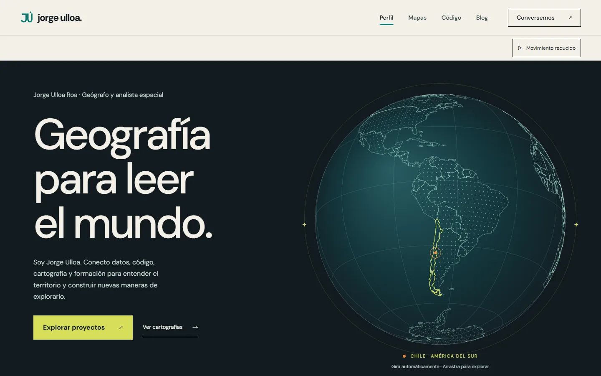
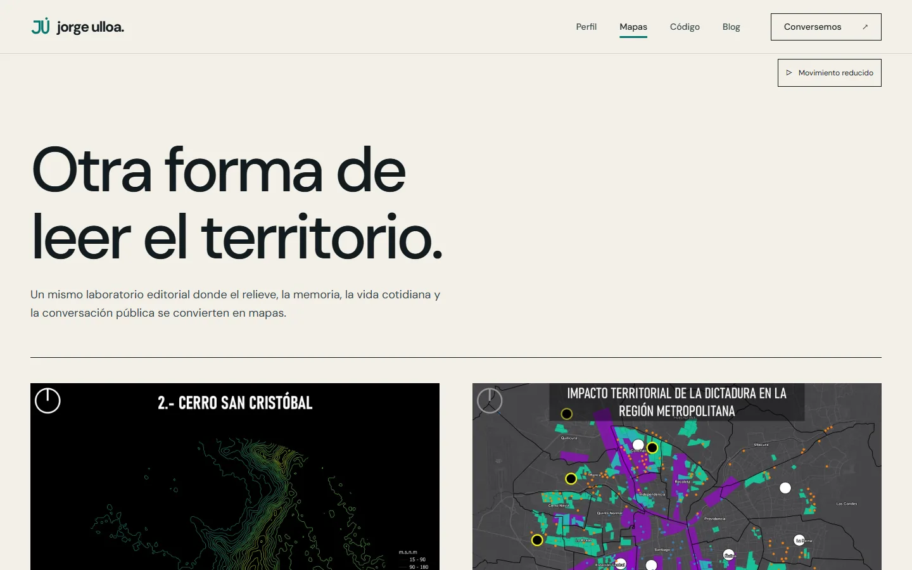

# Portafolio de Jorge Ulloa Roa

> Geografía para leer el mundo: análisis espacial, herramientas a medida, docencia y cartografía editorial.

[](https://github.com/geoidegeoidal/geoidegeoidal.github.io/actions/workflows/dynamic/pages/pages-build-deployment)

**Sitio en vivo → [geoidegeoidal.github.io](https://geoidegeoidal.github.io/)**



| Ruta | Contenido |
| --- | --- |
| [`/`](https://geoidegeoidal.github.io/) | Perfil, proyectos, cursos, ConMapas, trayectoria, herramientas y contacto |
| [`/maps.html`](https://geoidegeoidal.github.io/maps.html) | Archivo ConMapas: cartografía editorial de autor |
| [`/code.html`](https://geoidegeoidal.github.io/code.html) | Catálogo de código: aplicaciones, plugins y experimentos |
| [`/blog.html`](https://geoidegeoidal.github.io/blog.html) | Bitácora con artículos técnicos |



## Desarrollo local

Requiere Ruby, Bundler y las herramientas de compilación de Ruby para tu sistema (RubyInstaller + DevKit en Windows).

```sh
bundle install
bundle exec jekyll serve
```

Abrir <http://localhost:4000>. La publicación continúa a través de la configuración existente de GitHub Pages; no se incorpora otro servicio de hosting.

En Windows, `jekyll serve --detach` no funciona porque Ruby Windows no implementa `fork`. Para automatización, construye `_site` y sírvelo temporalmente con `python -m http.server`.

## Verificación

Comprobación rápida, sin dependencias más allá de Python estándar y Node:

```sh
bundle exec jekyll build
python tests/check_site.py _site
node tests/seo_check.cjs
node --check assets/js/site.js
node --check assets/js/motion.js
```

`check_site.py` comprueba rutas locales, imágenes, anclas, metadatos, un H1 por página, textos alternativos y XML. Para verificar una instalación en subdirectorio:

```sh
bundle exec jekyll build --baseurl /portfolio
python tests/check_site.py _site --baseurl /portfolio
```

Suite de navegador (dependencias exclusivas de desarrollo, con el sitio servido):

```sh
cd tests
npm install
npx playwright install chromium
npm test
npm run test:motion
```

| Prueba | Cubre |
| --- | --- |
| `browser_check.cjs` (`npm test`) | Errores JavaScript, respuestas fallidas y axe A/AA en seis rutas × cuatro anchos |
| `motion_check.cjs` (`npm run test:motion`) | Globo, pausa, persistencia, arrastre, geolocalización, movimiento reducido y fallbacks sin JS/datos |
| `arcade_logic.cjs` | Transición, victoria, daño, derrota y pausa del arcade de tres etapas |
| `map_selector_check.cjs` | Selector de cinco mapas, selección ante fallo y reintento |
| `research_layout_check.cjs` | Contención de la nota de investigación en seis anchos |
| `responsive_reading_check.cjs` | Contención de contenido interno de 320 a 1920 px |
| `seo_check.cjs` | JSON-LD, entidades enlazadas y noindex del 404 |
| `propuesta_check.cjs` | `propuesta.html`, página archivada de comparación |
| `monograph_check.cjs` | Edición monográfica archivada (SKIP mientras permanezca archivada) |

`TEST_SITE_URL` cambia el servidor de las pruebas y `BROWSER_CHANNEL` elige un navegador instalado (por ejemplo `msedge`). Las solicitudes de Formspree se interceptan durante las pruebas y no llegan al servicio real.

Prueba manual complementaria: menú móvil y Escape, visor con Enter y Escape y retorno del foco, fichas técnicas, contacto desde las cuatro páginas, validación del formulario, conexión fallida, vista sin JavaScript y movimiento reducido. **No enviar mensajes reales al probar: simular las respuestas del endpoint de Formspree.**

## Estructura

| Archivo | Rol |
| --- | --- |
| `index.html` | Perfil, proyectos, cursos, ConMapas, trayectoria, herramientas y formulario |
| `maps.html` | Archivo ConMapas: galería, créditos y metodologías |
| `code.html` | Catálogo de proyectos y experimentos, con alcance y documentación |
| `blog.html`, `_posts/` | Bitácora y artículos Markdown con `layout: post` |
| `_data/projects.json` | Catálogo curado; `featured` controla la selección de portada |
| `_data/technologies.json` | Niveles declarados y uso demostrado por herramienta |
| `_config.yml` | Nombre, descripción, correo, redes y URL pública |
| `_layouts/`, `_includes/` | Navegación, pie, metadatos y datos estructurados |
| `assets/css/style.css` | Tokens y estilos compartidos, incluida la adaptación móvil |
| `assets/css/motion.css` | Entradas por scroll, progreso de lectura y estilos del globo |
| `assets/js/site.js` | Mejoras progresivas de menú, visor nativo y formulario |
| `assets/js/motion.js` | Globo Canvas, pausa global y movimiento reducido |
| `assets/data/atlas.json` | Costas de Natural Earth para el globo (fuente en `assets/data/README.md`) |

## Diseño

Dirección vigente: **atlas editorial**. DM Sans local para títulos y cuerpo (licencia OFL en `assets/fonts/OFL.txt`). Sin dependencias JavaScript de producción ni peticiones de fuentes a terceros.

Paleta ConMapas (interpretación de la obra, no una marca oficial extraída):

| Función | Hex |
| --- | --- |
| Papel — base de lectura | `#F3F0E7` |
| Carbón — texto | `#121B20` |
| Turquesa — contacto | `#06766F` |
| Amarillo — acciones | `#D6DE59` |
| Violeta — acentos editoriales | `#783D9B` |
| Naranja — destaque puntual | `#E88D42` |

Las cartografías originales conservan sus colores: el sitio no las recolorea.

## Movimiento cartográfico

La portada incluye un globo ortográfico Canvas con costas reales de Natural Earth, Chile destacado, rotación automática continua (unos 84 segundos por vuelta), arrastre horizontal con ratón o tacto y controles de teclado. `atlas.svg` mantiene la escena sin JavaScript o si falla la carga de datos.

`motion.css` y `motion.js` añaden entradas de títulos y secciones y lectura progresiva. El botón global permite pausar el movimiento y conserva la preferencia entre páginas. Se respeta `prefers-reduced-motion`. El globo limita resolución y frecuencia y deja de dibujar fuera de pantalla o con la pestaña en segundo plano.

## Decisiones y límites

- **Mejora progresiva**: navegación, galería y formulario operan sin JavaScript (el formulario usa POST nativo).
- **Formulario**: conserva el endpoint Formspree existente; la recepción final del correo depende de esa cuenta. Nunca reemplazar el endpoint ni el correo sin información del propietario.
- **Sin inventar datos**: las afirmaciones profesionales se mantienen del portafolio original. Antes de editar contenido, revisar vigencia de fechas y cifras y añadir evidencia a los resultados de proyectos.
- **Curaduría**: 27 repositorios revisados el 6–7 de septiembre de 2026. La portada prioriza LUZ·RM, Azimut, AutoAtlas Pro y HuellaRETC; ConMapas, IEMA e IDE-MMA mantienen su espacio profesional; tres experimentos se marcan «Work in Progress». Las notas de cada proyecto delimitan lo que demuestra el código revisado y no equivalen a una auditoría de la aplicación.
- **Publicación**: GitHub Pages desde `main`. `AGENTS.md` y `HANDOFF.md` son memoria de trabajo del repositorio y no se publican en el sitio, igual que `tests/` y `readme-assets/`.
- **`Gemfile.lock`** se ignora a propósito: el lock generado en Windows no se conserva.

## Contacto

- Sitio: [geoidegeoidal.github.io/#contacto](https://geoidegeoidal.github.io/#contacto)
- LinkedIn: [jorge-ulloa-roa](https://www.linkedin.com/in/jorge-ulloa-roa/)
- GitHub: [geoidegeoidal](https://github.com/geoidegeoidal)

Cartografía base del globo: Natural Earth. Trabajo editorial de mapas: [ConMapas](https://www.instagram.com/conmapas/).
